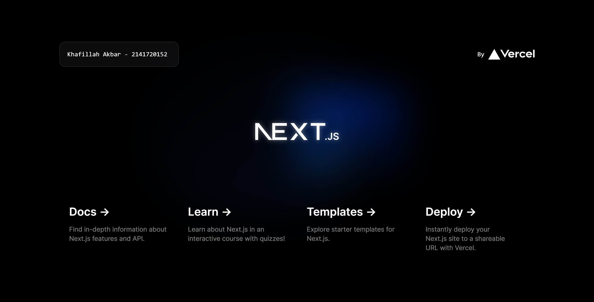
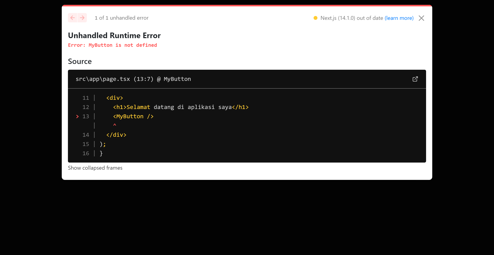
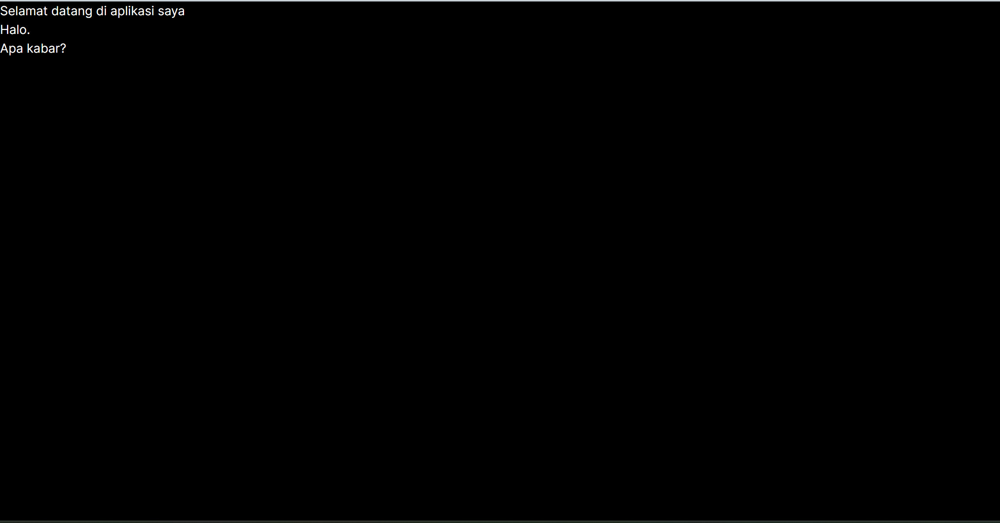

This is a [Next.js](https://nextjs.org/) project bootstrapped with [`create-next-app`](https://github.com/vercel/next.js/tree/canary/packages/create-next-app).

## Getting Started

First, run the development server:

```bash
npm run dev
# or
yarn dev
# or
pnpm dev
# or
bun dev
```

Open [http://localhost:3000](http://localhost:3000) with your browser to see the result.

You can start editing the page by modifying `app/page.tsx`. The page auto-updates as you edit the file.

This project uses [`next/font`](https://nextjs.org/docs/basic-features/font-optimization) to automatically optimize and load Inter, a custom Google Font.

## Laporan Praktikum

|  | Pemrograman Berbasis Framework 2024 |
|--|--|
| NIM |  2141720152 |
| Nama |  Khafillah Akbar S |
| Kelas | TI - 3I |


### Jawaban Soal 1

Soal 1
Pada gambar tersebut, silakan Anda browsing apa yang dimaksud dengan:

- TypeScript = Bahasa pemrograman yang kuat yang menambahkan dukungan untuk tipe data statis ke JavaScript. Dalam konteks Next.js, menggunakan TypeScript berarti  dapat menambahkan tipedata statis ke aplikasi, yang membantu mencegah kesalahan selama pengembangan dan meningkatkan kejelasan kode.

- ESLint = ESLint adalah alat untuk menganalisis kode JavaScript dan mendeteksi potensi masalah dalam kode. Ini membantu dalam menerapkan standar kode, mencegah bug, dan memastikan kualitas kode yang lebih baik. Dalam pengembangan Next.js, penggunaan ESLint membantu  menjaga kualitas kode JavaScript.

- Tailwind CSS = Tailwind CSS adalah kerangka kerja CSS yang memungkinkan  untuk merancang antarmuka pengguna dengan cepat dengan menggunakan kelas-kelas utilitas. Dalam Next.js, User dapat menggunakan Tailwind CSS untuk merancang tampilan aplikasi  dengan cepat dan dengan kode yang lebih sedikit.

- App Router = Ini mungkin merujuk pada perutean aplikasi dalam konteks Next.js. Next.js menyediakan routing yang terintegrasi, yang memungkinkan  untuk menavigasi antar halaman aplikasi dengan mudah. Anda dapat menggunakan router bawaan Next.js atau paket-paket seperti next/router untuk mengatur perutean dalam aplikasi .

- Import alias = Import alias adalah cara untuk membuat alias (alias) untuk direktori atau modul dalam kode JavaScript . Ini berguna untuk membuat rute relatif lebih singkat dan membantu dalam mengelola ketergantungan. Dalam pengembangan Next.js, user dapat menggunakan import alias untuk membuat rute import lebih ringkas dan lebih mudah dipahami.

### Jawaban Soal 2
Soal 2
Pada struktur project tersebut, jelaskan kegunaan folder dan file masing-masing tersebut!

- node_modules:

Folder ini berisi semua dependensi (pakage pihak ketiga) yang dibutuhkan oleh proyek Next.js. Ketika menginisialisasi proyek Next.js atau menambahkan dependensi menggunakan package manager seperti npm atau Yarn, paket-paket ini diinstal ke dalam folder node_modules.

- public:

Folder public adalah tempat menempatkan aset statis seperti gambar, font, dan berkas lain yang ingin Anda layankan apa adanya oleh server web. Aset-aset ini dapat diakses melalui jalur URL mereka.

- src:

Folder src umumnya berisi kode sumber aplikasi Next.js.Folder ini mungkin berisi berbagai file dan subdirektori tergantung pada struktur dan kebutuhan proyek.Biasanya,akan menemukan komponen, halaman, gaya, utilitas, dan modul lain yang diorganisir di dalam folder src.
Komponen: Komponen React yang dapat digunakan kembali yang membentuk antarmuka pengguna aplikasi.

### Jawaban Soal 3


Contoh perubahan.

### Jawaban Soal 4


Perubahan seperti diatas, program mengalami error karena nama fungsi yang dipanggil berbeda dengan nama fungsi yang dideklarasikan.

### Jawaban Soal 5


Ini Merupakan tampilan menggunakan JSX markup pada fungsi MyPage()

### Jawaban Soal 6


